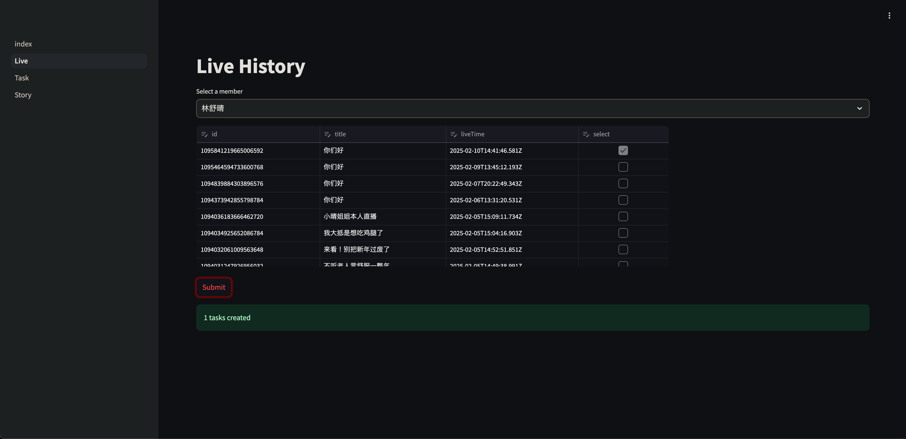
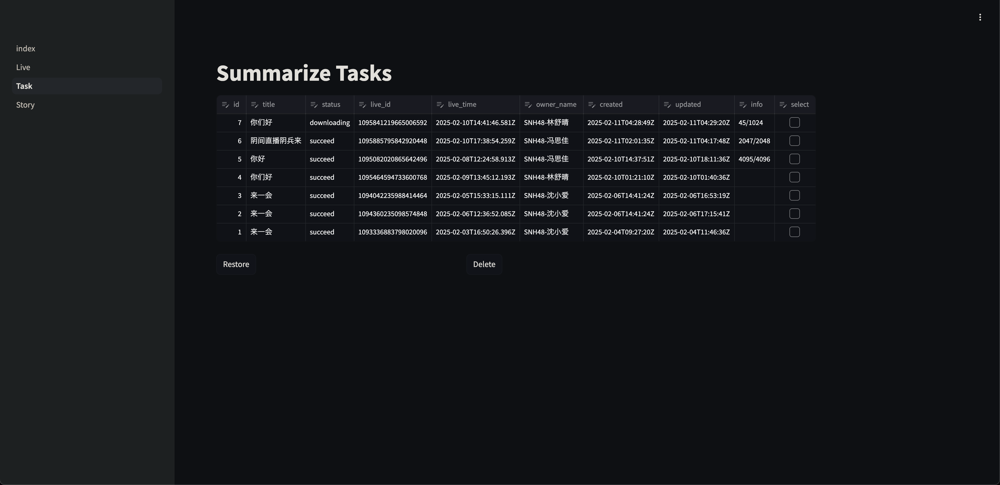
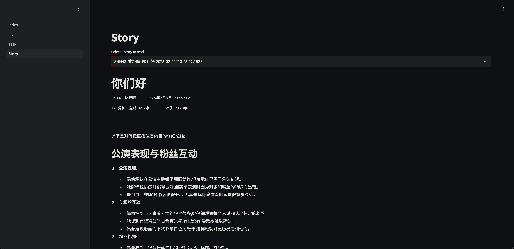

# Liveguard

调用语音转录+大语言模型API，获取口袋48直播的AI总结报告。







## 结构

- **Backend (back)**
    - 口袋48的client，获取直播列表，下载直播
    - 接入[AssemblyAI](https://www.assemblyai.com/)，获取直播的转录文本及AI总结；价格约为**0.4刀/小时**
    - golang+sqlite，仅有一张表，以任务模式处理事件

- **Frontend (front)**
  - 通过直播列表创建任务，查看任务状态（下载进度等），查看AI总结
  - streamlit实现

## 配置

详见`back/config.example.yaml`

## 部署

使用docker-compose方式部署。

### 部署仓库

部署专用的文件在[zyfy29/deploy](https://github.com/zyfy29/deploy/tree/liveguard)的`liveguard`分支下。

```sh
git clone -b liveguard https://github.com/zyfy29/deploy.git liveguard-deploy/
cd liveguard-deploy/
touch liveguard.db

# 编辑配置文件
mv config.example.yaml config.yaml 
mv .example.env .env
```

部署目录应有以下文件：

```
liveguard-deploy/
├── liveguard.db
├── config.yaml
├── .env              # 主机上的映射端口号
└── docker-compose.yaml
```

### 构建

首次启动
```sh
docker compose up -d
```

强制更新容器
```sh
docker compose up -d --pull always
```

### 使用

前后端公开在`.env`文件设定的端口上。

访问`http://<server-ip>:<FRONT_PORT>`即可。

## 贡献

欢迎参与开发，若有想法请先提issues！

可能的开发计划
- 其他口袋token的获取方式
- 将口袋client模块抽离为go library
- 重构测试模块，不依赖db，使用测试专用token
- 前端优化
- 总结报告的外部投稿
- 口袋每日发言AI总结

## Star History

[](https://star-history.com/#zyfy29/liveguard)
